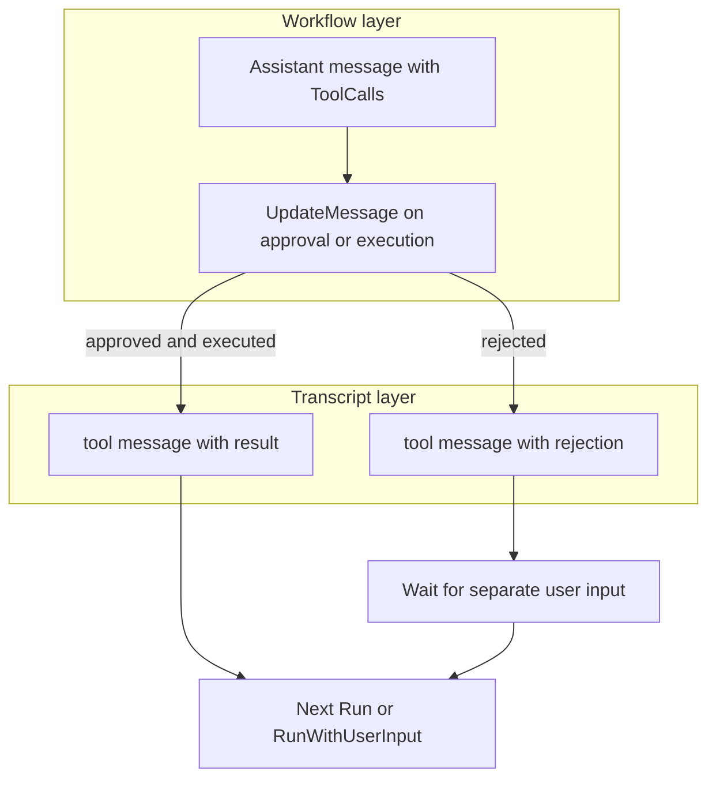
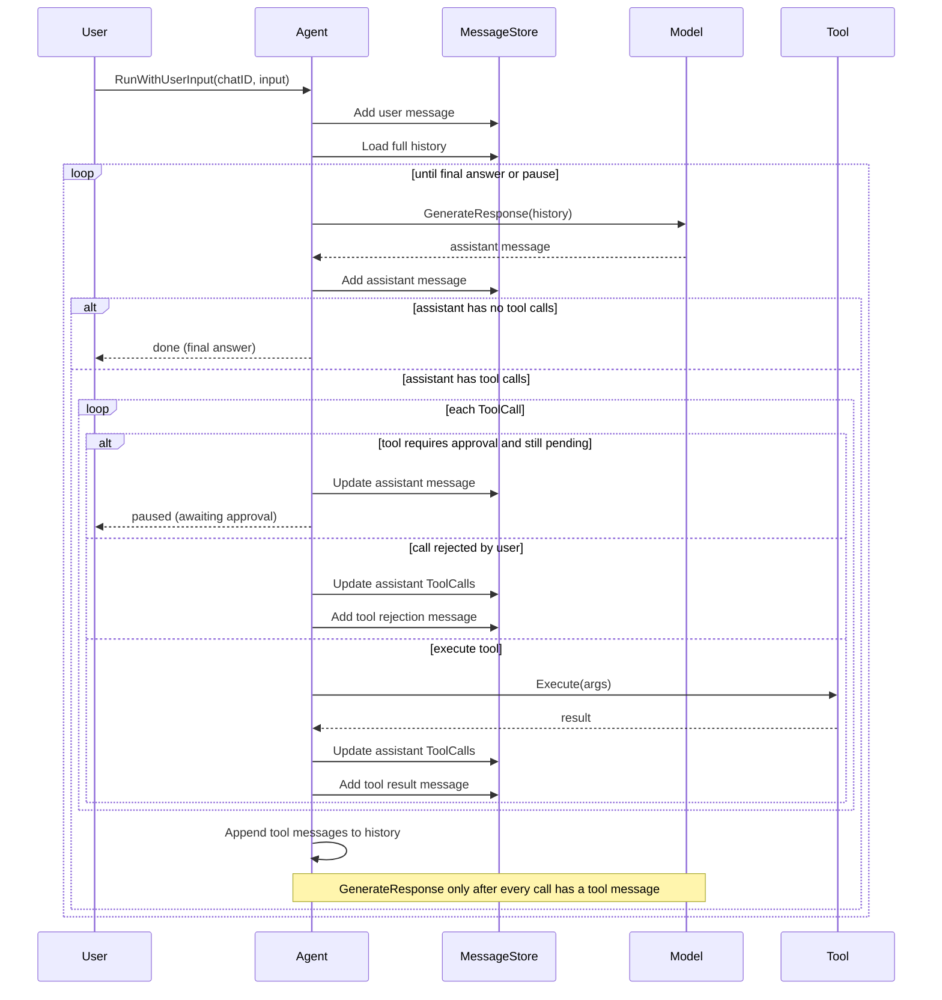

# Architecture

Gogent is a library for building agentic applications.

Key features:
- Human-in-the-loop guardrails for tool integrations.

## Components

- **Model** — calls the LLM with conversation history and returns the next assistant message. Implementations live in provider packages (e.g. `openai.NewChat(...).Build()`).
- **MessageStore** — persists chat history so it can be loaded and continued later.
- **Tool** — interfaces the agent with functions written by a developer.
- **ToolRegistry** — lookup table of registered tools available to an agent.
- **Agent** — orchestrates the conversation loop: load history, call the model, execute tools, persist results, repeat until the model produces a final answer or a guardrail pauses the run.

## Message types

All conversation state is stored as a ordered list of `Message` values. Each message has an internal `ID` (assigned by gogent), a `Role`, and role-specific fields.

| Role | Created by | Purpose | Key fields |
|------|------------|---------|------------|
| `user` | Application / `NewUserMessage` | Input from the end user | `Content` |
| `assistant` (text) | Model / `NewAssistantMessage` | Final model reply with no pending tool work | `Content` |
| `assistant` (tool request) | Model / `NewAssistantMessageWithToolCalls` | Model asking to run one or more tools | `Content` (optional), `ToolCalls` |
| `tool` | Agent / `NewToolResultMessage` | Result of a single executed tool call | `ToolCallID`, `Content` |

### Field rules

- **`ToolCalls`** is only set on `assistant` messages. It holds every tool the model requested in that turn. A single assistant message may contain multiple tool calls when the provider supports parallel tool calling.
- **`ToolCallID`** is only set on `tool` messages. It must match the `ID` of the corresponding entry in the assistant message's `ToolCalls` slice. OpenAI and other providers use this ID to correlate results with requests.
- **`Content` on `tool` messages** holds the serialized tool output (usually JSON as a string). This is what gets sent back to the model on the next request.

### ToolCall (embedded in assistant messages)

Each entry in `ToolCalls` tracks the lifecycle of one requested call:

| Field | Purpose |
|-------|---------|
| `ID` | Provider-assigned call ID (e.g. OpenAI `call_abc123`) |
| `ToolName` | Name of the tool to invoke |
| `Args` | JSON arguments parsed from the model |
| `ApprovalStatus` | `pending`, `approved`, or `rejected` — used for human-in-the-loop guardrails |
| `ExecutionStatus` | `pending`, `running`, `completed`, or `failed` |
| `Result` | JSON output after execution; also copied into the corresponding `tool` message `Content` |

## Workflow state vs model transcript

Gogent uses two layers that must not be confused:

| Layer | Mechanism | Audience | Examples |
|-------|-----------|----------|----------|
| **Workflow state** | Mutate `ToolCall` fields on the assistant message + `MessageStore.UpdateMessage` | Agent, UI, persistence | `ApprovalStatus`, `ExecutionStatus`, cached `Result` |
| **Model transcript** | Append new messages via `MessageStore.AddMessages` | LLM on the next `GenerateResponse` | `tool` result messages; `user` messages from a separate follow-up input |

Mutating the assistant message alone does **not** inform the model about user decisions. Providers such as OpenAI have no field for approval status on `tool_calls`. The model only sees what is appended after the tool-request turn — typically one `tool` message per call.



**Do append for the model:** tool results and rejection denials.

**Do not append for the model:** pure status changes such as `pending` → `approved`, or in-progress execution state. User feedback after a rejection is a separate `RunWithUserInput` call, not part of `RejectToolCall`.

The OpenAI adapter strips gogent-only `ToolCall` fields when serializing assistant messages. Only `id`, tool name, and arguments are sent to the provider.

## Interaction lifecycle

The agent runs a loop until the model returns a final assistant message, a guardrail pauses execution, or `maxIterations` model turns is reached. Tool resolution does not count toward that limit.



### Step-by-step

**1. User input**

The application calls `Agent.RunWithUserInput`, which creates a `user` message and persists it:

```
{ role: user, content: "What's the weather in Paris and London?" }
```

**2. Model turn**

The agent loads the full history and calls `Model.GenerateResponse`. The model adapter serializes history (including any prior tool results) to the provider API and parses the response into a gogent `Message`.

Two outcomes:

- **Final answer** — assistant message with text only, no `ToolCalls`. The agent stops and returns.
- **Tool request** — assistant message with one or more `ToolCalls`. Execution continues below.

Example assistant tool request:

```
{
  role: assistant,
  content: "",
  tool_calls: [
    { id: "call_a", tool_name: "get_weather", args: {"city":"Paris"}, approval: pending, execution: pending },
    { id: "call_b", tool_name: "get_weather", args: {"city":"London"}, approval: pending, execution: pending }
  ]
}
```

**3. Tool execution**

For each `ToolCall` on the assistant message:

1. Resolve the tool from `ToolRegistry`.
2. If the tool `RequiresApproval()` and the call is still `pending`, persist the assistant message and **pause** the run. The application must approve or reject the call and resume later.
3. If the call is **rejected**, mark it failed, append a **`tool` message** with a denial payload (do not execute the tool), and continue with any remaining calls in the same turn.
4. Otherwise auto-approve (if still pending and approval is not required), execute the tool, mark the call `completed`, and store the result on the `ToolCall`.
5. Create one **`tool` message per call** (result or rejection) and persist it:

```
{ role: tool, tool_call_id: "call_a", content: "{\"temp_c\":18}" }
{ role: tool, tool_call_id: "call_b", content: "{\"error\":\"rejected\",\"message\":\"Tool call rejected by user.\"}" }
```

The agent only calls the model again once **every** `ToolCall` in that assistant turn has a corresponding `tool` message in the transcript.

**4. Next model turn**

The agent appends the assistant message and all new tool result messages to in-memory history, then loops back to step 2. The model sees the tool outputs and either responds with text or requests more tools.

Example final assistant message:

```
{ role: assistant, content: "Paris is 18°C and London is 12°C." }
```

### End states

| Outcome | Condition |
|---------|-----------|
| Success | Assistant message with no `ToolCalls` |
| Paused for approval | Tool with `RequiresApproval()` and call not yet approved |
| Error | Store error, or `maxIterations` model turns exceeded |

Tool execution failures and unknown tools append structured `tool` error messages to the transcript so the model can recover on the next turn.

## Provider mapping (OpenAI)

Gogent's message shape mirrors the OpenAI Chat Completions tool-calling protocol:

| gogent | OpenAI |
|--------|--------|
| `user` message | `role: user` |
| `assistant` message (text) | `role: assistant` with `content` |
| `assistant` message (tool request) | `role: assistant` with `tool_calls` array |
| `tool` message | `role: tool` with `tool_call_id` and `content` |
| `ToolCall.ID` | `tool_calls[].id` |
| `ToolCall.Args` | `tool_calls[].function.arguments` (JSON string on the wire) |

The model adapter is responsible for serializing gogent messages to the provider schema on the way out and parsing provider responses back into `Message` and `ToolCall` values on the way in. The agent loop itself is provider-agnostic.

## Human-in-the-loop

Tools may set `RequiresApproval()` to opt into manual review before execution. When the model requests such a tool:

1. The assistant message (with pending `ToolCalls`) is persisted.
2. The agent returns without executing the tool or creating `tool` messages.
3. The application calls **`ApproveToolCall`** or **`RejectToolCall`** as separate operations.

### Approve

`ApproveToolCall` sets `ApprovalStatus` to `approved` on the requested call. The agent **does not run** until every `ToolCall` on that assistant message is settled (approved or rejected). Once all outstanding calls are settled, the agent runs once: executes approved calls, appends `tool` result messages, and continues to the next model turn when the tool turn is complete.

### Reject

`RejectToolCall` is a single operation that:

1. Sets `ApprovalStatus` to `rejected` on the assistant message.
2. Appends a `tool` message with a structured denial payload.
3. **Stops without calling the model.**

User feedback after a rejection is a **separate API call** via `RunWithUserInput`. That appends a normal `user` message and then runs the agent, so the model sees the rejection `tool` message and the user's follow-up in one turn.

```
RejectToolCall(chatID, messageID, toolCallID)
  → assistant ToolCall marked rejected
  → tool message appended
  → agent stops

RunWithUserInput(chatID, "Please suggest an alternative instead.")
  → user message appended
  → model called with full history
```

Rejected calls are never executed. Approval-only status changes are workflow mutations and are not sent to the provider.
