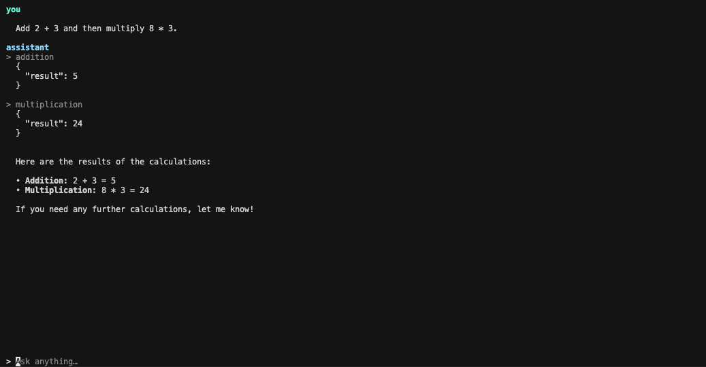

# TUI example

A minimal terminal chat Text UI (Claude/Codex-style)



## Prerequisites

- Go 1.25+
- `OPENAI_API_KEY` in the environment or in a `.env` file at the **repository root**

## Run

```bash

cd examples/tui

# Provide API Key. Can also set this in an `.env` file in `examples/tui/`.
export OPENAI_API_KEY=my-api-key

go run .
```